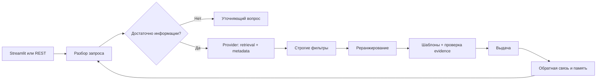

# RecAgent — автономный прототип

Диалоговый подбор фильмов, сериалов и курсов: запрос на русском → структурированные ограничения → кандидаты → фильтры → реранжирование → объяснения с проверкой фактов.

Создан по описанию «Задача №8». **API Recsflow, реальный каталог и история пользователей не предоставлены.** Поэтому используется заменяемый `DemoProvider` и воспроизводимый синтетический каталог из 84 объектов, seed=42. Названия, атрибуты, оценки и демо-история вымышлены. Прототип не подключён к Recsflow.

## Быстрый запуск

Требуется Python 3.11. На текущем компьютере окружение уже установлено.

```powershell
cd 'C:\Users\roev_\Documents\ChatGPT\МТС'
.\start-demo.ps1
```

Если PowerShell запрещает запуск скриптов, выполните напрямую:

```powershell
.\.venv\Scripts\python.exe -m streamlit run app.py
```

Откройте http://127.0.0.1:8501. Если этот порт занят уже запущенным демо, используйте его или добавьте `--server.port 8502`.

Установка на другом компьютере, из корня проекта:

```bash
python -m venv .venv
# Windows:
.venv\Scripts\python -m pip install -r requirements-lock.txt
.venv\Scripts\python -m streamlit run app.py
# Linux / macOS:
.venv/bin/python -m pip install -r requirements-lock.txt
.venv/bin/python -m streamlit run app.py
```

`requirements-lock.txt` фиксирует все версии проверенного окружения. `requirements.txt` содержит допустимые диапазоны основных зависимостей. Docker-конфигурация подготовлена, но сборка контейнеров в этой сессии не проверялась:

```bash
docker compose up --build
```

Чат: http://127.0.0.1:8501. Документация REST: http://127.0.0.1:8000/docs.

## Что попробовать

1. «Посоветуй что-нибудь» → уточнение формата.
2. «Хочу детективный сериал, не мрачный и не длиннее одного сезона» → подборка.
3. В том же диалоге: «Не дольше 30 минут» → дополнительный фильтр, прежние ограничения сохранены.
4. «Ещё» → исключение уже показанных вариантов. Если кандидаты закончились, ответ будет пустым.
5. «Без ограничений по длительности» → снятие ограничения на минуты.
6. «Курс по машинному обучению для новичка, без воды» → смена формата, новый набор ограничений.
7. `Сериал похожий на «Тайна старого маяка»` — известное название можно взять из каталога. Поддержан осторожный поиск единственного близкого названия при небольшой опечатке или изменении окончания.
8. «Сброс» → сброс предпочтений в этой сессии. Бюджет LLM не обнуляется.

Демо-профиль имеет синтетическую историю из двух объектов. У нового пользователя истории нет. «Нравится», «Не подходит», «Уже знакомо» влияют на последующие выдачи. Ответ можно скачать в JSON, а источники каждого объяснения — раскрыть в карточке.

Длительность означает время **одной серии**, **всего фильма** или **всего курса**. Нельзя интерпретировать её как общее время просмотра сериала. Демо-реранкер использует синтетический `quality`, совпадение жанра с историей и сходство с seed-объектом; это не обученная модель.

## Локальная LLM

Режим `rules` запускается без модели и предназначен для воспроизводимого показа. Это ограниченный разбор по правилам, а не полноценное понимание русского языка.

Режим `ollama` вызывает настоящую локальную модель через `/api/chat`, передаёт JSON Schema, проверяет результат Pydantic и дополняет обработкой явных ограничений. В интерфейсе выберите «Локальная LLM · Ollama». По умолчанию используется установленная на данном компьютере `qwen3:8b`.

На другом компьютере установите Ollama с официального сайта и загрузите модель:

```bash
ollama pull qwen3:8b
```

Для REST API режим и модель задаются **перед запуском процесса**:

```powershell
$env:RECAGENT_MODE = 'ollama'
$env:OLLAMA_MODEL = 'qwen3:8b'
$env:OLLAMA_URL = 'http://127.0.0.1:11434'
.\.venv\Scripts\python.exe -m uvicorn recagent.api:app --host 127.0.0.1 --port 8000
```

Таймаут LLM — 45 секунд, максимум 8 попыток на сессию, максимум 700 выходных токенов на вызов. Ошибка модели или исчерпание бюджета включают правила; ответ явно содержит `mode=rules_fallback` и предупреждение. Фактические попытки и токены отражаются в JSON. Неизвестное число токенов при таймауте не считается известной стоимостью.

Сбой источника каталога возвращает сообщение о недоступности. Его данные никогда не подменяются синтетическими незаметно для клиента.

## REST API

Запуск без LLM:

```powershell
$env:RECAGENT_MODE = 'rules'
.\.venv\Scripts\python.exe -m uvicorn recagent.api:app --host 127.0.0.1 --port 8000
```

Пример на Python:

```python
import httpx

with httpx.Client(base_url="http://127.0.0.1:8000", timeout=60) as client:
    first = client.post("/v1/chat", json={
        "user_id": "new-user",
        "message": "Хочу лёгкий детективный сериал, один сезон",
    }).raise_for_status().json()
    second = client.post("/v1/chat", json={
        "user_id": "new-user",
        "session_id": first["session_id"],
        "message": "Не дольше 30 минут",
    }).raise_for_status().json()
    print(second)
```

| Метод | Путь | Назначение |
|---|---|---|
| GET | `/health` | Режим и имя источника; не проверяет готовность Ollama |
| POST | `/v1/chat` | Сообщение; необязательный `session_id`; `user_id` |
| POST | `/v1/feedback` | `session_id`, показанный `item_id`, `reaction`: `like/dislike/seen` |
| GET | `/docs` | Интерактивная схема OpenAPI |

Статусы ответа: `clarify`, `recommend`, `no_results`. Неподходящие объекты не добавляются для заполнения пяти мест. Отсутствующая/истёкшая сессия возвращает 404, неверный вход — 422, лимит сессий — 503. Сессия привязана к `user_id`, однако это **не аутентификация**: идентификаторы в демо задаёт сам клиент.

## Архитектура и подключение Recsflow



Граф действительно реализован на LangGraph. Память хранится отдельно в `Session` в пределах процесса; это не персистентный checkpointer. Для каждого диалога есть блокировка, TTL 1 час и общий лимит 500 сессий. Чат и REST используют одно ядро, но **разные процессы и независимые сессии**.

Точка интеграции — `RecommendationProvider` в `recagent/providers.py`:

- `retrieve(user_id, query, limit)` → список ID кандидатов;
- `lookup(item_ids)` → проверенные `Item`;
- `history(user_id)` → известные/потреблённые ID;
- `find_title(title)` → объект каталога или `None`.

Это наш предлагаемый интерфейс адаптера, **не документированный контракт Recsflow**. Реальный HTTP-адаптер намеренно не выдуман. Команда заказчика реализует эти четыре метода и передаст адаптер в `Agent(provider=...)`; FastAPI создаётся через `create_app(agent)`. Подробный порядок и пример — `docs/integration.md`.

Объяснения состоят только из шаблонов, по одному проверяемому факту на шаблон. `Evidence` содержит ID, поле, значение и связь с запросом, историей или seed-объектом. Проверка запрещает неподтверждённые связи. Свободная генерация объяснений LLM не используется, поэтому риск её галлюцинаций здесь ограничен конструкцией, а не высоким баллом LLM-судьи.

## Проверка и воспроизводимость

Команды ниже выполняются из корня проекта активированным Python окружения:

```bash
python -m pytest -q
python -m recagent.catalog --seed 42 --output data/catalog.json
python -m scripts.evaluate
python -m scripts.evaluate --mode ollama --llm-evaluation --output report/evaluation-ollama.json
# Отдельно запустить REST API в режиме rules, затем:
python -m scripts.load_test --requests 100 --concurrency 8
python -m scripts.build_report
```

В оценке 12 фиксированных сценариев: ограничения, уточнение, память, смена формата, исключение жанра, пустая выдача, снятие ограничения, похожие объекты и неизвестное название. `success_rate` проверяется по скрытым условиям сценария независимым oracle, а не по извлечённому агентом запросу. Это функциональный benchmark, не оценка удовлетворённости реальных людей. В нагрузочном тесте измеряется полный HTTP-запрос, включая открытие соединения.

Флаг `--llm-evaluation` включает реальный LLM-симулятор первого сообщения и отдельный вызов LLM-судьи. Продолжения сценариев остаются фиксированными. Ошибки симуляции/судьи, fallback, токены и доля завершённых оценок сохраняются явно. Судья консультативный: его вердикт не заменяет oracle. При использовании одной модели ошибки симулятора и судьи могут коррелировать.

Артефакты:

- `report/index.html` — отчёт с результатами и ограничениями;
- `report/evaluation.json` — оценка без LLM;
- `report/evaluation-ollama.json` — проверка локальной модели, симулятора и судьи;
- `report/evaluation-ollama-initial.json` — первый прогон, выявивший ошибку отрицания;
- `report/load-test.json` — реальный локальный HTTP-прогон;
- `notebooks/demo.ipynb` — воспроизводимый пример диалога;
- `docs/demo-script.md` — сценарий показа на 2–5 минут (видеозапись не записана).

## Границы прототипа

1. Нет реальной интеграции, обученного retrieval/reranker и бизнес-метрик на данных заказчика.
2. В правилах поддерживается ограниченный словарь; многозначные и составные отрицания требуют развития. Даже структурно валидный ответ LLM может неверно понять пользователя.
3. Настройка тона и длины объяснений под бренд пока не вынесена в API; шаблоны централизованы в `grounding.py`.
4. Уточнение основано на недостающем формате/теме и ошибках, а не на обученной оценке ожидаемого прироста качества. Противоречия обрабатываются частично.
5. Retrieval ограничен 100 кандидатами; на большом реальном каталоге нужен адаптер с фильтрами/пагинацией и замерами recall.
6. Нет авторизации, долговременной памяти, межпроцессной синхронизации, квот на пользователя и production-наблюдаемости. Запускать локально, одним worker. Для Docker также опубликованы только loopback-порты.
7. Локальная стоимость не равна нулю: денежная оценка не рассчитана, измерены попытки вызовов и доступные счётчики токенов.
8. Для продуктивизации: согласовать контракт и семантику полей → заменить источник → собрать реальный holdout → оценить retrieval/диалоги людьми → добавить auth, Redis, квоты, логи и мониторинг → провести нагрузочные тесты с целевой LLM.

## Реперные источники

- [Peng et al., A Survey on LLM-powered Agents for Recommender Systems, Findings EMNLP 2025](https://aclanthology.org/2025.findings-emnlp.620/) — обзор роли LLM-агентов в рекомендациях.
- [Evaluating Conversational Recommender Systems with Large Language Models, 2025](https://arxiv.org/abs/2501.09493) — пользовательская оценка диалоговых рекомендаций; используемый здесь малый тестовый набор не воспроизводит эксперименты статьи.
- [Ollama: Structured Outputs](https://docs.ollama.com/capabilities/structured-outputs) — JSON Schema и валидация Pydantic.
- [LangGraph: Graph API](https://docs.langchain.com/oss/python/langgraph/graph-api) — конечный граф обработки запроса.

## Hugging Face и дообучение

Добавлен отдельный pipeline классификации намерений: `scripts/prepare_hf_dataset.py` создаёт JSONL, `scripts/train_lora.py` обучает модель через `transformers.Trainer` и PEFT LoRA. Зависимости вынесены в `requirements-hf.txt`.

Проверка pipeline без скачивания модели:

```powershell
.\.venv\Scripts\python.exe -m scripts.prepare_hf_dataset --output data/dialogues.jsonl
.\.venv\Scripts\python.exe -m scripts.train_lora --dry-run
```

Реальное обучение после установки `requirements-hf.txt`: `python -m scripts.train_lora --data data/dialogues.jsonl --model cointegrated/rubert-tiny2 --output artifacts/intent-lora`. Синтетические строки проверяют воспроизводимость, но не доказывают качество. Для защищаемого дообучения нужны обезличенные размеченные диалоги и разбиение train/validation по пользователю или диалогу. Модель подключается после сравнения с rules/Ollama на holdout, поэтому экспериментальный классификатор не спрятан в production-path без оценки.
